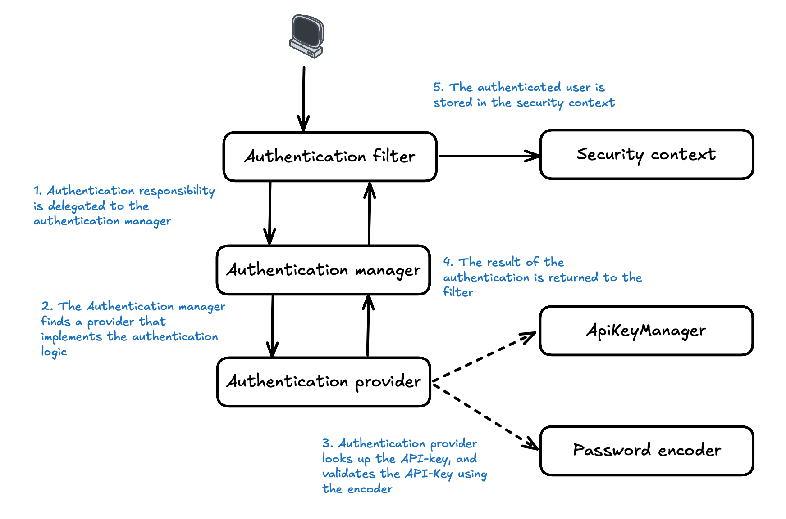

# Spring Security Custom Filter Demo

A Spring Boot demo project that implements **stateless API key authentication** using a custom Spring Security filter chain. The project uses a Todo API as the protected resource.

---

## Table of Contents
- [Overview](#overview)
- [Token Format](#token-format)
- [How API Key Loading Works](#how-api-key-loading-works)
- [Spring Security Flow](#spring-security-flow)
- [In-Memory API Key Manager](#in-memory-api-key-manager)
- [Bringing Your Own Store](#bringing-your-own-store)
- [Endpoints](#endpoints)
- [Running the Project](#running-the-project)
- [Using the API](#using-the-api)

---

## Overview

Instead of username/password or OAuth2, this project authenticates requests using **opaque API keys** passed as Bearer tokens. Keys are stored securely by hashing the secret portion — the plain-text secret is never stored.

---

## Token Format

A token is made up of two parts separated by a `.`:

```
<prefix>.<secret>
```

| Part     | Example                  | Stored?                  |
|----------|--------------------------|--------------------------|
| `prefix` | `IsVLZW5qQYiOQ_of`       | ✅ Yes — used as a lookup key |
| `secret` | `df8pZTr0gDCXqEk...`     | ❌ No — only its hash is stored |

**Example token:**
```
IsVLZW5qQYiOQ_of.df8pZTr0gDCXqEkYRS5kXzP4kDT6_YNgdFmTdScyRZU
```

This design means that even if your store is compromised, the raw secrets cannot be recovered.

---

## How API Key Loading Works

Naive approaches look up API keys by iterating over all keys and comparing hashes — O(n) per request. This project uses an efficient two-step approach:

### 1. Prefix Lookup (O(1))

The `prefix` is stored in plain text and should be indexed in your store. On each request, the prefix is extracted from the token and used to fetch exactly one key record, including its roles.

### 2. Secret Verification

Once the key record is fetched by prefix, the secret portion of the token is verified against the stored hash:

```java
if (!apiKeySecretEncoder.matches(tokenSecret, apiKeyDetails.hash())) {
    throw new BadCredentialsException("Invalid API key");
}
```

This means **every request costs one indexed lookup + one hash comparison** — regardless of how many keys exist.

---

## Spring Security Flow



The custom `ApiKeyAuthFilter` extracts the token from the `Authorization` header and creates an unauthenticated `ApiKeyAuthenticationToken`. This is passed to the `AuthenticationManager`, which delegates to `ApiKeyAuthenticationProvider`. The provider performs the prefix lookup and secret verification. If successful, it returns an authenticated token containing an `ApiKeyPrincipal` with the caller's details and roles.

### Key classes

| Class | Role |
|---|---|
| `ApiKeyAuthFilter` | Reads the `Authorization: Bearer <token>` header, delegates to `AuthenticationManager` |
| `ApiKeyAuthenticationToken` | Carries credentials (unauthenticated) or principal + authorities (authenticated) |
| `ApiKeyAuthenticationProvider` | Validates the token and builds the authenticated token |
| `ApiKeyPrincipal` | Immutable record representing the authenticated caller (`id`, `name`, `publicId`) |
| `ApiKeyManager` | Interface for looking up and creating keys — implement this to bring your own store |
| `ApiKeyGenerator` | Generates cryptographically random `prefix.secret` tokens using `SecureRandom` |
| `ApiKeySecretEncoder` | Encodes and verifies the secret portion of a token |

---

## In-Memory API Key Manager

When no `ApiKeyManager` bean is registered, the application automatically falls back to `InMemoryApiKeyManager`. A warning is logged on startup:

```
WARN  Using in-memory API key manager. This is not suitable for production use!
```

On startup, `SeedKeys` detects that the active manager is `InMemoryApiKeyManager` and seeds two development keys automatically:

```
WARN  Using generated API keys for development:

          - User API Key:  <token>
          - Admin API Key: <token>

      These keys are for development purposes only and should not be used in production.
```

> **Note:** Copy the tokens — they cannot be recovered after restart since only the hash is stored, and all keys are lost when the application stops.

If you register your own `ApiKeyManager` bean, `SeedKeys` detects it is not an `InMemoryApiKeyManager` and **skips seeding entirely** — your store is left untouched.

---

## Bringing Your Own Store

Implement the `ApiKeyManager` interface and register it as a `@Bean`. The in-memory fallback will be disabled automatically.

```java
public interface ApiKeyManager {
    ApiKeyDetails findByToken(String token);
    CreateApiKeyResponse create(String name, String... roles);
    boolean existsByName(String name);
}
```

### JPA Example

**Entity:**
```java
@Entity
class ApiKey {

    @Id
    @GeneratedValue(strategy = GenerationType.IDENTITY)
    private Long id;

    @Column(nullable = false, unique = true, updatable = false)
    private String prefix;

    @Column(nullable = false)
    private String name;

    @ElementCollection
    private Set<String> roles = new HashSet<>();

    @Column(nullable = false)
    private String hash;

    @Column(nullable = false)
    private boolean active = true;

    protected ApiKey() {}

    public static ApiKey create(String prefix, String name, String hash, Set<String> roles) {
        ApiKey key = new ApiKey();
        key.prefix = prefix;
        key.name = name;
        key.hash = hash;
        key.roles = roles;
        return key;
    }

    // getters...
}
```

**Repository:**
```java
interface ApiKeyRepository extends JpaRepository<ApiKey, Long> {

    @Query("""
        select k from ApiKey k
        left join fetch k.roles
        where k.prefix = :prefix and k.active = true
    """)
    Optional<ApiKey> findActiveByPrefix(String prefix);

    boolean existsByName(String name);
}
```

**Manager:**
```java
@Component
class JpaApiKeyManager implements ApiKeyManager {

    private final ApiKeyRepository repository;
    private final ApiKeyGenerator generator;
    private final ApiKeySecretEncoder encoder;

    // constructor...

    @Override
    public ApiKeyDetails findByToken(String token) {
        String prefix = token.split("\\.", 2)[0];
        ApiKey key = repository.findActiveByPrefix(prefix)
                .orElseThrow(() -> new ApiKeyNotFoundException("API key not found"));

        return new ApiKeyDetails(
                key.getId(),
                key.getName(),
                key.getPrefix(),
                key.getHash(),
                List.copyOf(key.getRoles())
        );
    }

    @Override
    public CreateApiKeyResponse create(String name, String... roles) {
        GeneratedApiKey generated = generator.generate();
        ApiKey key = ApiKey.create(
                generated.prefix(),
                name,
                encoder.encode(generated.secret()),
                Set.of(roles)
        );
        ApiKey saved = repository.save(key);
        return new CreateApiKeyResponse(saved.getId(), saved.getName(), generated.token());
    }

    @Override
    public boolean existsByName(String name) {
        return repository.existsByName(name);
    }
}
```

Once this bean is present, the in-memory fallback is disabled and `SeedKeys` will not seed any keys.

---

## Endpoints

| Method | Path | Required Role | Description |
|--------|------|---------------|-------------|
| `GET`  | `/api/todos` | Any authenticated | List all todos |
| `POST` | `/api/todos` | `ADMIN` | Create a new todo |

---

## Running the Project

### Prerequisites

- Java 21+

### Run the application

```bash
./mvnw spring-boot:run
```

The application starts with the in-memory manager. Two development keys are printed to the console:

```
WARN  Using generated API keys for development:

          - User API Key:  <token>
          - Admin API Key: <token>
```

> **Note:** Copy the tokens — they are lost on restart.

---

## Using the API

Pass your API key as a Bearer token in the `Authorization` header:

```http
GET /api/todos
Authorization: Bearer <your-token>
```

```http
POST /api/todos
Authorization: Bearer <admin-token>
Content-Type: application/json

{
  "title": "Write documentation"
}
```

### Example with curl

```bash
# List todos
curl -H "Authorization: Bearer <your-token>" http://localhost:8080/api/todos

# Create a todo (requires ADMIN key)
curl -X POST \
  -H "Authorization: Bearer <admin-token>" \
  -H "Content-Type: application/json" \
  -d '{"title":"Write documentation"}' \
  http://localhost:8080/api/todos
```
